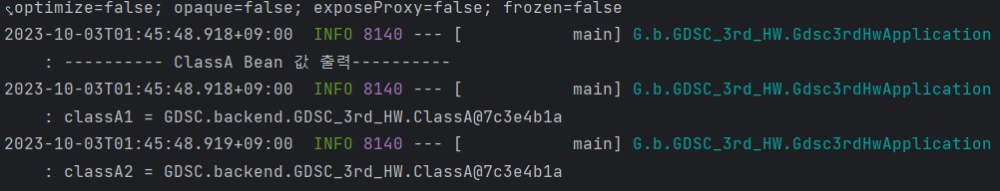
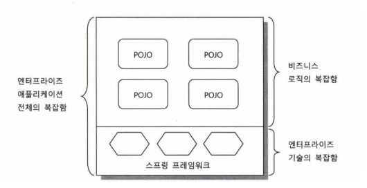

# 3주차

<br/>

## 과제

_classA , classB , classC_


_classA1 , classA2_



<br/>

# **POJO**

## POJO

Plain Old Java Object

- **조건**

1. 특정 규약에 종속되지 않는다

   자바 언어와 꼭 필요한 API 외에는 종속되지 않아야

   큰 가치를 주지도 못하는 규약 따위에 종속 X

   객체지향 설계의 자유로운 적용이 가능한 오브젝트여야만 POJO라고 불릴 수 있음

2. 특정 환경에 종속되지 않는다

   특히 비즈니스 로직을 담고 있는 클래스나 인터페이스를 사용해서는 안됨

3. 객체지향적인 자바 언어의 기본에 충실하게 만들어져야 한다.

간단히 말해, POJO란

객체지향적인 원리에 충실하면서,

환경과 기술에 종속되지 않고 필요에 따라 재활용될 수 있는 방식으로 설계된 오브젝트

- **장점**

1. 특정 기술, 환경에 종속되지 않는 오브젝트는 그만큼 깔끔한 코드가 될 수 있음
2. 환경의 제약이 X → 자동화된 테스트에 이점이 됨
3. 객체지향적 설계를 자유롭게 적용할 수 있음

즉, 자바의 객체지향 설계의 장점들을 최대한 이용할 수 있다는 장점을 가짐

- **프레임워크**

**POJO 프레임워크** : POJO 프로그래밍을 가능하도록 기술적인 기반을 제공하는 프레임워크



**스프링**

1. 비즈니스 로직의 복잡함과 엔터프라이즈 기술의 복잡함을 분리해서 구성할 수 있게 도와줌
2. POJO 프레임워크로서 자신을 직접 노출하지 않으면서 어플리케이션을 POJO로 쉽게 개발할 수 있게 지원한다.

- **비즈니스로직**
  자료의 조작과 계산의 수행
- **엔터프라이즈**
  개별 사용자가 아니라 조직에서 사용하는 컴퓨터 소프트웨어

# 스프링

## 스프링이란?

> 자바 엔터프라이즈 개발을 편하게 해주는 오픈소스 경량급 애플리케이션 프레임워크

자바의 특징인 객체 지향 언어의 특징을 이용하여

좋은 객체 지향 애플리케이션을 개발할 수 있게 도와주는 프레임워크

## Spring의 특징

1. 경량 컨테이너로 자바 객체를 직접 Spring 안에서 관리

   객체의 생성 및 소멸과 같은 생명 주기를 관리,

   Spring 컨테이너에서 필요한 객체를 가져와 사용

2. **IOC,** **DI**
   - 제어의 역전 (IOC , Inversion Of Control)
   - 의존성 주입 (DI , Dependency Injection)

## Spring 은 왜 만들어졌을까?

> 스프링의 정수는 엔터프라이즈 서비스 기능을 POJO에 제공하는 것

즉, 분리됐지만 필요한 서비스 기술을

POJO 방식으로 개발된 애플리케이션 핵심 로직을 담은 코드에 제공

## Spring 의 기술

Spring 이 만들어진 목적을 이루기 위해선

POJO 프레임워크가 필요

이를 위해 다음과 같은 기술을 지원

- IoC / DI
- AOP
- PSA

# IoC

### IoC란?

**_제어의 역전_ Inversion of Control**

- **제어**
  객체 생명주기나 메서드의 호출을 직접 제어
  ⇒ 객체 생명주기나 메서드 호출을 직접 관리
  직접 객체를 생성하여 코드를 _제어_

  ```java
  public class A {
  		private B b;

  		public A() {
  				this.b = new B();
  		}
  }
  ```

  A 클래스에서 B를 필드로 가지고 있고,
  **생성자 내부에서 직접 생성**해 필드를 초기화있음
  이러한 코드를 객체 생명주기를 직접 제어하는 코드라고 할 수 있음

- **역전**
  프로그램의 제어 흐름을 직접 제어하는 것 X
  외부에서 관리하는 것

  ```java
  public class A {
  		private B b;

  		public A(B b) {
  				this.b = b;
  		}
  }
  ```

  이전 코드와 같이 A 클래스가 존재한다.
  하지만 이 코드에서는 **외부로부터 B를 인자로 받아** **초기화**하고 있습니다.
  이렇게 프로그램의 제어 흐름을 직접 제어하는 것이 아니라 외부에서 관리하는 것을 **제어를 역전시켰다**고 말할 수 있습니다.

  - **IoC와 DIP**
    - 목적
      _클래스 간 결합을 느슨히 하기 위함_
      한 클래스의 변경에 따른 다른 클래스들의 영향을 최소화
      → 애플리케이션을 지속가능하고 확장성 있게 만든다.

# Spring Bean

## Spring Bean

- 의존성 문제

  ```java
  public class A {
      private B b;

      public A(B b) {
          this.b = b;
      }
  		...
  }

  public class B {
  		...
  }
  ```

  A 클래스를 생성하기 위해선 B 클래스가 존재해야 함
  이때, A 클래스는 B 클래스에 대한 **의존성**을 가진다고 말함\
  즉, _한 객체가 다른 객체를 **사용할 때** 의존성이 있다_ 고 함

  ```java
  public static void main(String[] args) {
      A a = new A(new B());
  }
  ```

  그래서 A 클래스를 생성하기 위해서 위와 같은 구문이 필요
  클래스 간에 의존 관계가 있다는 것은 한 클래스가 바뀔 때
  다른 클래스가 영향을 받는다는 것을 의미
  Spring은 **Spring Bean**을 통해 위와 같은 **의존성 문제**를 더 쉽게 해결할 수 있도록 해줍니다.

### Spring Bean이란?

스프링 IoC 컨테이너에 의해 관리되는 자바 객체

### 스프링 IoC 컨테이너란?

빈을 관리하는 객체

`ApplicationContext` 라는 인터페이스가 IoC 컨테이너를 대표

`ApplicationContext` 는 여러 인터페이스를 상속받아 만들어짐

이에 빈 조회, 이벤트 발행, 환경변수 조회 등 다양한 기능을 구현

```java
@Test
void findAllBean(){
    String[] beanDefinitionNames = applicationContext.getBeanDefinitionNames();
    for (String beanDefinitionName : beanDefinitionNames) {
        Object bean = applicationContext.getBean(beanDefinitionName);
        log.info("name=" + beanDefinitionName + " object=" + bean);
    }
}
```

위는 모든 빈을 조회하는 테스트

위 결과 값에서 볼 수 있듯이

`ApplicationContext` 를 통해 빈에 대한 작업을 할 수 있음

### 빈 스코프

빈이 생성되고 존재하고 적용되는 범위를 지정

- 싱글톤 : 기본 스코프, 스프링 컨테이너의 시작과 종료까지 유지되는 가장 넓은 범위의 스코프
- 프로토타입 : 스프링 컨테이너는 프로토타입 빈의 생성과 의존관계 주입까지만 관여하고 더는 관리하지 않는 매우 짧은 범위의 스코프
- 웹 관련 스코프
  request : 웹 요청이 들어오고 나갈때 까지 유지되는 스코프
  session : 웹 세션이 생성되고 종료될 때 까지 유지되는 스코프
  application : 웹의 서블릿 컨텍스트와 같은 범위로 유지되는 스코프

빈의 스코프는 `@Scope` 어노테이션을 통해 지정할 수 있음

```java
@Scope("prototype")
@Component
public class Prototype {
	...
}
```

스프링은 기본적으로 별다른 설정을 하지 않으면 내부에서 생성하는 빈 오브젝트를 모두 싱글톤으로 만듦

### 스프링의 싱글톤

스프링은 싱글톤 패턴을 사용

애플리케이션이 시작 될 때, 인스턴스를 메모리에 딱 하나 할당하고, 뒤의 호출 시 마다 해당 인스턴스를 반환해주는 디자인 패턴

이를 적용하면 이미 만들어진 객체를 공유해서 효율적인 사용이 가능

스프링에서는 이를 위해 IoC 컨테이너를 사용

이를 이용하여 싱글턴 패턴의 모든 단점을 해결하면서 객체를 싱글톤으로 유지할 수 있음

### 빈과 의존성 주입

의존성을 주입한다고 하면 어디에선가 new 키워드를 사용하여 객체를 생성해야 함

```java
public class Service {
		private final Dao dao;

		public Service(Dao dao) {
				this.dao = dao;
		}
}
```

```java
Service service = new Service(new JdbcDao());
```

예시 코드를 보면 Service를 초기화하는데 Service의 생성자로 Dao 구현체를 생성하여 넣어주고 있음

> 만약 Dao 구현체가 바뀐다면 어떻게 될까?

서비스를 생성하는 곳에서도 변경이 일어남

서비스를 생성할 때 Dao를 초기화함과 동시에 어떤 Dao의 구현체를 선택할 것인지에 대한 책임도 있기 때문

```java
LineService lineService = new LineServie(new StationsDao(), new LineDao(), new SectionDao());
```

또한 의존성을 주입할 때 여러 개의 의존성이 필요하다면 해당 의존성 주입 순서를 알아야 함

직접 의존성을 주입하기 위해서는 의존 관계를 모두 파악해야하는 번거로움이 생김

또한 많은 객체가 중복 생성

그래서 _의존성 주입이 필요한 객체를 빈으로 등록_ 하여,

스프링 IoC 컨테이너가 객체의 생성과 의존성 주입을 관리하도록 해야함

### 스프핑 IoC 컨테이너는 빈을 어떻게 관리할까?

**IoC 컨테이너가 빈의 라이프사이클을 관리하는 과정**

1. 객체 생성 + property 설정

   먼저 Spring IoC 컨테이너가 생성이 되면 빈 스코프가 싱글톤인 객체를 생성

   이때 빈으로 등록하기 위해서 다양한 Configuration 메타데이터를 이용하여 통일된 Bean Definition을 생성

   그리고 빈으로 등록할 POJO와 Bean Definition 정보를 이용하여 빈을 생성

   이 과정에서 싱글톤 패턴을 사용하는 것이 아닌 평범한 자바 클래스를 이용하여 객체를 생성

2. 의존 설정
3. 객체 초기화 → 사용 → 소멸

### 빈 설정 방법

```java
public class Appconfig {
    @Bean // @Bean 어노테이션을 이용
    public BeanA beanA() {
        return new BeanA();
    }

    @Bean
    public BeanB beanB() {
        return new BeanB(beanA());
    }

    @Bean
    public BeanC beanC() {
        return new BeanC(beanA());
    }
}
```

```java
@Test
void notSingleton(){
    Appconfig appConfig = new Appconfig();

    BeanA beanA1 = appConfig.beanA();
    BeanA beanA2 = appConfig.beanA();

    log.info("beanA1 = " + beanA1);
    log.info("beanA2 = " + beanA2);

    assertThat(beanA1).isNotSameAs(beanA2);
}
```

같은 객체를 출력했지만 값이 다름

`BeanA` 객체가 2번 만들어진 것

이는 싱글톤이 X

스프링에서 빈을 싱글톤으로 관리하기 위해,

`@Configuration` 어노테이션을 이용해야함

```java
@Configuration
public class Appconfig {
    @Bean
    public BeanA beanA() {
        return new BeanA();
    }

    @Bean
    public BeanB beanB() {
        return new BeanB(beanA());
    }

    @Bean
    public BeanC beanC() {
        return new BeanC(beanA());
    }
}
```

```java
@Test
void singleton(){
    ApplicationContext ac = new AnnotationConfigApplicationContext(Appconfig.class);

    BeanA beanA1 = ac.getBean("beanA",BeanA.class);
    BeanA beanA2= ac.getBean("beanA",BeanA.class);

    log.info("beanA1 = " + beanA1);
    log.info("beanA2 = " + beanA2);

    assertThat(beanA1).isSameAs(beanA2);
}
```

```java
@Test
void singleton2(){
    ApplicationContext ac = new AnnotationConfigApplicationContext(Appconfig.class);

    BeanB beanB = ac.getBean("beanB",BeanB.class);
    BeanC beanC= ac.getBean("beanC",BeanC.class);
    BeanA beanA1 = beanB.getBeanA();
    BeanA beanA2= beanC.getBeanA();

    log.info("beanA1 = " + beanA1);
    log.info("beanA2 = " + beanA2);

    assertThat(beanA1).isSameAs(beanA2);
}
```

`ApplicationContext`의 구현체인

`AnnotationConfigApplicationContext` 에 파라미터로 넘긴 값은 스프링 빈으로 등록

위 코드에서 `AppConfig` 를 파라미터로 넘겼으므로,

`**AppConfig` 와 해당 파일에 빈으로 등록한 것들이 스프링 빈으로 등록됨\*\*

_AppConfig_

`BeanB`를 만들기 위해 `BeanA`가 생성되어야 하고,

`BeanC`를 만들기 위해 `BeanA`가 또 생성되어야함

이렇게 한다면 싱글톤이 아니게됨

하지만 스프링이 이를 싱글톤으로 유지할 수 있게 도와줌

`@Configuration` 어노테이션을 사용하면,

스프링이 바이트 코드를 조작해서 싱글톤이 보장할 수 있게 다른 객체를 생성해서 저장한다고 한다.

간단히 말해서, **빈을 싱글톤으로 생성하기 위해선,**

`**@Configuration` 어노테이션을 사용한 객체를\*\*

`**ApplicationContext`의 파라미터로 넘기면 된다\*\* 할 수 있다.

## Compoent Scan

과정이 너무 번거롭고, 빈 개수가 많아질 때

`@Component` 를 이용한다면 간단하게 스프링 빈 등록이 가능

### Compoent Scan이란?

스프링이 애플리케이션의 클래스를 검색하고,

자동으로 스프링 빈을 등록하는 방법

이러한 방식으로 빈을 자동으로 구성함으로써,

애플리케이션의 구성 및 설정을 간소화

`@ComponentScan` , `@Component` 어노테이션을 이용

``@**Component`\*\*

스프링 빈으로 등록하려는 클래스에 붙일 수 있는 어노테이션

스프링은 이 어노테이션이 붙은 클래스를 자동으로 검색하고 빈으로 등록

이전 예시에 사용했던 class에 `@Component`를 붙인 후, 빈 조회를 할 경우 등록된 것을 볼 수 있음

```java
@Component
public class BeanA {
	...
}

@Component
public class BeanB {
	...
}

@Component
public class BeanC {
	...
}
```

```java
public class AutoAppconfig {}
```

```java
AnnotationConfigApplicationContext applicationContext
		= new AnnotationConfigApplicationContext(AutoAppconfig.class);

@Test
void findAllBean(){
    String[] beanDefinitionNames = applicationContext.getBeanDefinitionNames();
    for (String beanDefinitionName : beanDefinitionNames) {
        Object bean = applicationContext.getBean(beanDefinitionName);
        log.info("name=" + beanDefinitionName + " object=" + bean);
    }
}
```

`**@ComponentScan**`

`@Component` 를 붙인 클래스를 스프링이 찾도록 지정

스프링이 어느 패키지에서 클래스 검색을 시작할지 및 검색할 패키지의 범위를 설정

```java
@ComponentScan
public class AutoAppconfig {}
```

기본적으로 `@ComponentScan` 이 붙은 설정 정보 클래스의 패키지가 시작 위치가 됨

**`@Configuration`, `@Service`, `@Controller`, `@Repository`**

모두 컴포넌트 스캔 대상
