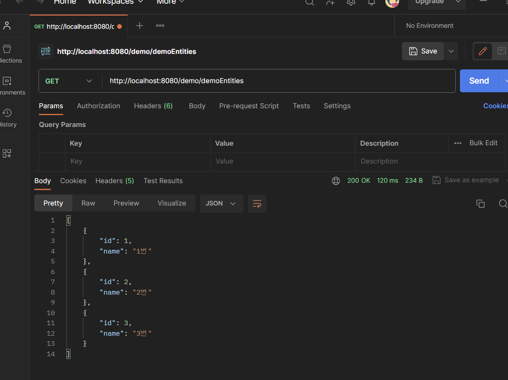
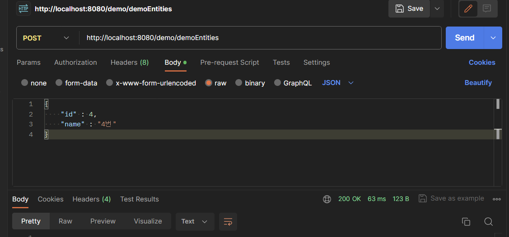
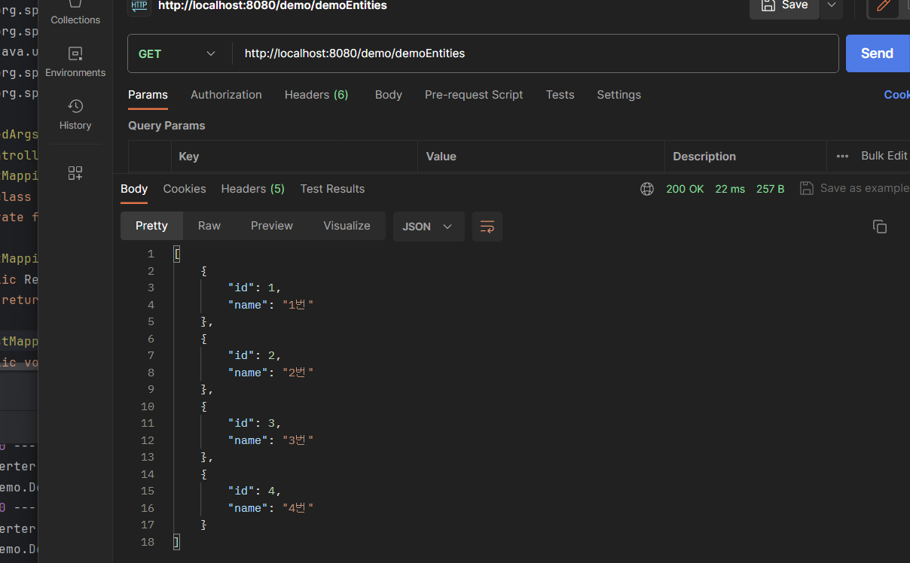
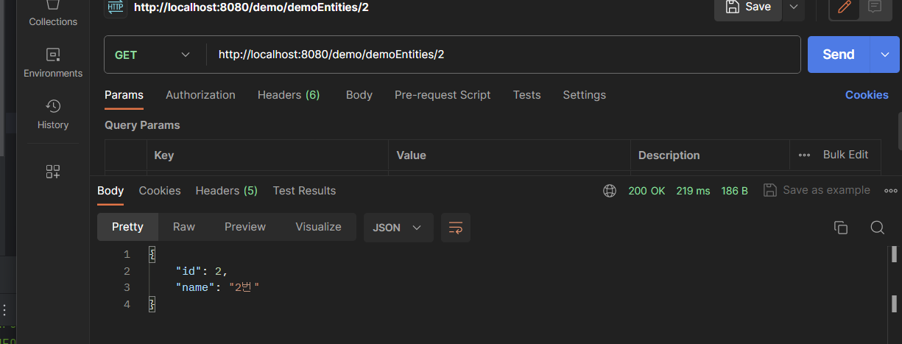
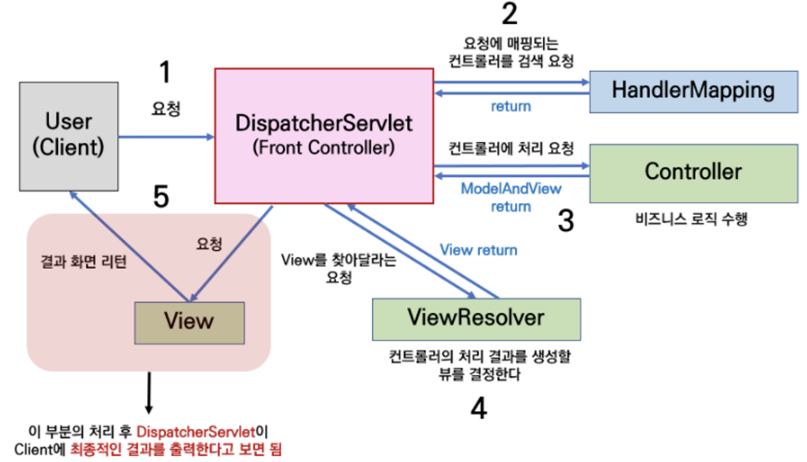

# 5주차

<aside>
💡 **과제**

</aside>









<aside>
💡 **MVC란 무엇인가**

</aside>

## 🔹MVC

주로 웹 어플리케이션과 그 외의 사용자 인터페이스를 가진 어플리케이션을 설계할 때 사용되는 디자인 패턴

데이터 처리, 사용자 인터페이스, 그리고 제어 로직을 분리하여

각각의 책임을 명확하게 구분

1. **Model (모델)**

- 데이터와 비즈니스 로직을 처리
- 데이터베이스와의 상호 작용, 쿼리 실행, 데이터 저장 및 조회와 같은 기본적인 작업을 포함합니다.
- 변경이 발생하면, 관련된 View에 알릴 수 있습니다.

_비즈니스 로직 : 업무에 필요한 데이터 처리를 수행하는 응용 프로그램의 일부_

1. **View (뷰)**

- 화면에 표시되는 UI (User Interface) 부분
- 데이터를 표시하거나 사용자와 상호작용을 위한 인터페이스를 표시하는 영역

1. **Controller (컨트롤러)**

- Model과 View 사이의 중개자 역할
- 클라이언트의 요청에 대해 실제 업무를 수행하는 Model 컴포넌트를 호출하고, 그 결과를 View에 전달한다.

## Spring MVC



`Model`에서는 페이지 처리에 필요한 정보들을 Database에 접근하여 쿼리문을 통해 가져온다.
데이터를 통해 얻은 Model 정보를 `Controller`에게 response 해주면, Controller는 이를 받아 Model을 완성시켜 `Dispatcher Servlet`에게 전달해준다.

개발자는 비즈니스 로직만 잘 작성하면 됨
나머지는 spring이 내부적으로 처리해줄 것

## 계층 구조 (Layered Architecture)

한 서비스를 여러 개의 논리적 레이어(계층)으로 나누는 설계 패턴

각 계층은 특정 역할과 책임을 가지며, 자신 아래 계층에 의존하는 구조를 가진다.


## Api Server 구조


1. Controller Layer : client와 통신하는 부분
2. Service Layer : 서비스 로직(비즈니스 로직)을 실행하는 부분
3. Repository Layer : DB와의 통신을 통해 데이터를 가져오는 부분

### Controller Layer

Client로부터 응답을 받는 계층

사용자의 요청에 해당하는 URI와 컨트롤러의 메소드를 매칭

이 메소드는 해당 요청에 맞는 Service Layer의 기능을 호출해 요청을 처리

서버에서 데이터를 받아서, 프론트 측에서 화면을 띄워주는 것이 일반적

그래서 Response로 view가 아닌 JSON 형식의 데이터를 반환하도록 할 것

_JSON : 경량의 데이터 교환 형식. 순수한 텍스트 형식이기 때문에 많은 프로그래밍 언어에서 읽고 쓸 수 있다 (밑은 예시)_

- _json 예시_
  ```java
  {
      "name": "John Doe",
      "age": 30,
      "isStudent": false,
      "hobbies": ["reading", "swimming", "gaming"],
      "address": {
          "street": "123 Main St",
          "city": "Springfield",
          "postalCode": "12345"
      }
  }
  ```

```java
@RestController
@RequiredArgsConstructor
@RequestMapping(value = "/demo")
public class DemoController {
    private final DemoService demoService;

//    @RequestMapping("/test/1/{id}")
    @GetMapping("/test/1/{id}")
    public DemoDto getAllStudents(@PathVariable Long id) {
        return demoService.getDemoEntity(id);
    }

//    @RequestMapping(method= RequestMethod.POST, value="/test/2")
    @PostMapping("/test/2")
    public void addStudent(@RequestBody DemoDto demoDto) {
        demoService.addDemoEntity(demoDto);
    }
}
```

`@RestController` : `@ResponseBody` + `@Controller`

`@ResponseBody`
: 메서드에서 반환하는 값을 HTTP 응답 body로 전송

view를 반환하지않고, JSON이나 XML 같은 데이터 형태를 클라이언트에게 전송할 때 유용하게 사용됩니다.
`@Controller` : 해당 클래스가 Spring MVC의 컨트롤러임을 나타냄

`@RequestMapping` : URI와 Controller 의 메소드를 매핑해준다.

`@ReqeustParam` : HTTP 요청 파라미터를 컨트롤러 메서드의 매개변수로 바인딩(구속)하는데 사용, 사용자로부터 입력값을 받을 때 주로 사용

`@PathVariable` : URI 패턴의 일부분을 동적으로 변수로 취급하고, 그 값을 컨트롤러 메서드의 매개변수에 바인딩

ex) `/activities/1` 에서 1 값을 읽기 위해 사용

`@RequestBody`

: HTTP 요청 본문(body)의 내용을 Java 객체로 변환하거나 바인딩할 때 사용

사용자로부터 입력값을 받을 때 주로 사용

`@GetMapping`: `@RequestMapping(method= RequestMethod.GET)` 과 동일

이를 바탕으로 위 예시를 해석해보자면,

위 클래스는 JSON 값을 반환하는 Controller 입니다.

또한 `@RequestMapping(value = "/demo")` 를 보고, 해당 클래스의 base url이 …/demo 임을 알 수 있습니다.

`getAllStudents` 메소드를 먼저 보자면, 이 함수의 url은 `GET /demo/test/1/{id}`라는 것을 알 수 있다.

controller클래스와 클래스 내부 메소드 모두에 @RequestMapping이 붙어있다면, Controller url + method url이 해당 메소드의 url이다.

이때 `{id}` 에 해당하는 부분은 `@PathVariable`을 이용하여, 해당 url에서 값을 읽어들일 수 있습니다.

이 값을 이용하여, 서비스 레이어의 로직을 처리함을 알 수 있다.

`addStudent` 메소드는 url이 `POST /demo/test/2` 입니다.

또한 이는 `@RequestBody` 를 통해 사용자로부터 데이터를 받아서,

해당 데이터를 서비스 레이어로 넘겨주는 것을 알 수 있다.

이처럼 Controller 는 사용자로부터 입력을 받는 부분을 설정하는 역할을 함

### Service Layer

실질적인 비즈니스 로직이 실행되는 계층

controller 계층의 하위 계층으로, controller 에서 매칭된 메소드가 service 레이어의 메소드를 실행하게 됨

주로 service 레이어의 역할은 repository 레이어에서 받아온 데이터를 전달받아 가공, 처리하고, 이를 controller 레이어에 넘겨주는 것

```java
@Service
@RequiredArgsConstructor
public class DemoService {
    private final DemoRepository demoRepository;

    @Transactional
    public DemoDto getDemoEntity(Long id) {
        DemoEntity demoEntity = demoRepository.findById(id).orElseThrow(RuntimeException::new);
        return new DemoDto(demoEntity.getId(), demoEntity.getStrA(), demoEntity.getStrB());
    }

    @Transactional
    public void addDemoEntity(DemoDto demoDto) {
        DemoEntity demoEntity = new DemoEntity(demoDto.getId(), demoDto.getStrA(), demoDto.getStrB());
        demoRepository.save(demoEntity);
    }
}
```

Service Layer의 클래스에는 `@Service` 어노테이션을 통해 해당 클래스가 Service Layer에 속함을 들어냄

Repository에서 데이터를 조회하여, 이를 **_DTO_**로 바꿔 전달하는 `getDemoEntity` 메소드와
클라이언트의 입력으로 받은 DemoDto 내용을 바탕으로 DemoEntity를 만들어 저장하는 `addDemoEntity` 메소드를 확인할 수 있음

- _DemoEntity_
  ```java
  @Entity
  @Getter
  @NoArgsConstructor(access = AccessLevel.PROTECTED)
  public class DemoEntity {
      @Id
      private Long id;
      private String strA;
      private String strB;

      public DemoEntity(Long id, String strA, String strB) {
          this.id = id;
          this.strA = strA;
          this.strB = strB;
      }
  }
  ```

### Repository Layer

특정 도메인 모델에 대한 CRUD(Create, Read, Update, Delete) 연산을 캡슐화하는 레이어

DB에서 값을 가져오거나, 변경할 때 이 레이어를 사용

```java
public class DemoRepository extends JpaRepository<DemoEntity, Long>{
}
```

### DTO (Data Transfer Object)

계층간 데이터 교환을 위해 사용하는 객체

주로 클라이언트와 서버 간 데이터 교환에 사용되며, 필요한 데이터만을 포함
특별한 로직을 가지지 않음

```java
@Getter
public class DemoDto {
    private Long id;
    private String strA;
    private String strB;

    public DemoDto(Long id, String strA, String strB) {
        this.id = id;
        this.strA = strA;
        this.strB = strB;
    }
}
```
